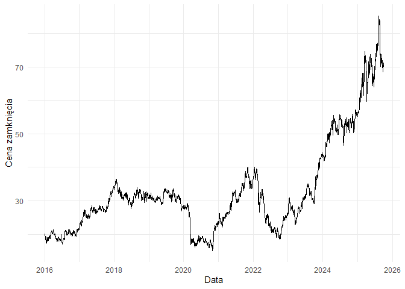
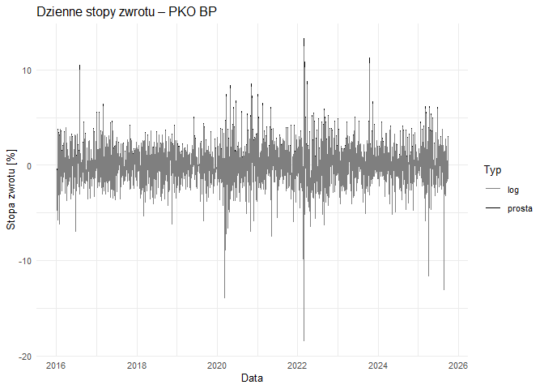
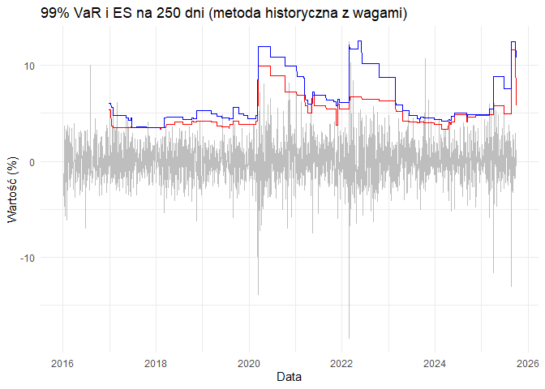

- [Wprowadzenie](#wprowadzenie)
  - [Załadowanie bibliotek i danych](#załadowanie-bibliotek-i-danych)
  - [Podstawowe statystyki opisowe dla stóp
    zwrotu](#podstawowe-statystyki-opisowe-dla-stóp-zwrotu)
  - [Wykres dzienny ceny zamknięcia](#wykres-dzienny-ceny-zamknięcia)
  - [Wykresy stóp zwortu](#wykresy-stóp-zwortu)
- [Wyznaczenie oszacowań 99% VaR i 99%
  ES ](#wyznaczenie-oszacowań-99-var-i-99-es)
  - [Metoda historyczna](#metoda-historyczna)
    - [Zmiana VaR i ES (N = 250) w
      czasie](#zmiana-var-i-es-n-250-w-czasie)
  - [Metoda historyczna z wagami](#metoda-historyczna-z-wagami)
    - [Zmiana VaR i ES w czasie](#zmiana-var-i-es-w-czasie)
- [Wyznaczenie jakości uzyskanych
  wyników](#wyznaczenie-jakości-uzyskanych-wyników)
  - [Przygotowanie danych do testu](#przygotowanie-danych-do-testu)
  - [Test Kupca (dystrybucyjny)](#test-kupca-dystrybucyjny)
    - [Metoda historyczna](#metoda-historyczna-1)
    - [Metoda historyczna z wagami](#metoda-historyczna-z-wagami-1)
  - [Test Christoffersona
    (niezależności)](#test-christoffersona-niezależności)
    - [Metoda historyczna](#metoda-historyczna-2)
    - [Metoda historyczna z wagami](#metoda-historyczna-z-wagami-2)
  - [Podsumowanie](#podsumowanie)

## Wprowadzenie

W projekcie analizuję dane dotyczące dziennych notowań akcji spółki PKO
BP S.A., pobrane ze strony Stooq.pl. Zakres danych obejmuje okres od
2016 do 2025 roku. PKO BP jest jedną z największych instytucji
finansowych w Polsce, dlatego jej akcje dobrze odzwierciedlają sytuację
na krajowym rynku kapitałowym.

Celem projektu jest oszacowanie poziomu ryzyka inwestycyjnego przy
użyciu dwóch popularnych miar: Value at Risk (VaR) oraz Expected
Shortfall (ES). Obie te miary pokazują, jak duża może być potencjalna
strata inwestora przy zadanym poziomie ufności. W pracy zastosuję dwie
różne metody wyznaczania VaR, a następnie sprawdzę ich skuteczność za
pomocą testów wstecznych. Dodatkowo zaprezentuję podstawowe statystyki
opisowe, wykres zmian cen i stóp zwrotu oraz krótko omówię wyniki w
kontekście najważniejszych wydarzeń rynkowych z analizowanego okresu.

### Załadowanie bibliotek i danych

Załadowanie bibliotek

``` r
library(tidyverse)
library(moments)
library(psych)
library(kableExtra)
```

Załadowanie danych

``` r
pko_d <- read.csv("pko_d.csv")
```

Dzienne stopy zwrotu

$`R_t = \frac{P_t - P_{t-1}}{P_{t-1}} = \frac{P_t}{P_{t-1}} - 1`$

``` r
stopy_zwrotu_d <- (pko_d$Zamkniecie[-1] / pko_d$Zamkniecie[-length(pko_d$Zamkniecie)]) - 1
```

Logarytmiczne stopy zwrotu

$`r_t = \ln\left(\frac{P_t}{P_{t-1}}\right)`$

``` r
pko_d_zwroty <- pko_d %>% 
  slice(-1)
stopy_log_d <- log(pko_d$Zamkniecie[-1] / pko_d$Zamkniecie[-length(pko_d$Zamkniecie)])
```

Dodanie stóp zwortu i różnic między nimi do ramki danych jako procent

``` r
pko_d_zwroty <- pko_d_zwroty %>%
  mutate(stopaprosta = stopy_zwrotu_d * 100,
  stopalog = stopy_log_d * 100,
  roznica = (stopy_zwrotu_d - stopy_log_d) * 100)
```

Przyjrzenie się danym

``` r
kable(head(pko_d_zwroty))
```

| Data | Otwarcie | Najwyzszy | Najnizszy | Zamkniecie | Wolumen | stopaprosta | stopalog | roznica |
|:---|---:|---:|---:|---:|---:|---:|---:|---:|
| 2016-01-05 | 20.5171 | 20.5171 | 19.8335 | 20.1093 | 2091841 | -1.3219685 | -1.3307843 | 0.0088158 |
| 2016-01-07 | 19.4024 | 19.9251 | 19.3187 | 19.7416 | 3557207 | -1.8285072 | -1.8454310 | 0.0169238 |
| 2016-01-08 | 19.7481 | 19.8173 | 19.1336 | 19.2494 | 6003306 | -2.4932123 | -2.5248193 | 0.0316070 |
| 2016-01-11 | 19.2109 | 19.2873 | 18.3198 | 18.3655 | 5590657 | -4.5918314 | -4.7005987 | 0.1087672 |
| 2016-01-12 | 18.5265 | 19.0807 | 18.4806 | 19.0573 | 3717157 | 3.7668454 | 3.6976326 | 0.0692129 |
| 2016-01-13 | 19.0879 | 19.2648 | 18.9117 | 19.1875 | 5043696 | 0.6832028 | 0.6808795 | 0.0023233 |

### Podstawowe statystyki opisowe dla stóp zwrotu

*Wartości dla stopy prostej i logarytmicznej podane są w procentach.*

``` r
kable(summary(pko_d_zwroty))
```

|  | Data | Otwarcie | Najwyzszy | Najnizszy | Zamkniecie | Wolumen | stopaprosta | stopalog | roznica |
|:---|:---|:---|:---|:---|:---|:---|:---|:---|:---|
|  | Length:2437 | Min. :14.89 | Min. :15.27 | Min. :14.65 | Min. :15.20 | Min. : 544620 | Min. :-16.82096 | Min. :-18.41748 | Min. :0.000000 |
|  | Class :character | 1st Qu.:23.86 | 1st Qu.:24.26 | 1st Qu.:23.51 | 1st Qu.:23.86 | 1st Qu.: 2026583 | 1st Qu.: -1.08078 | 1st Qu.: -1.08667 | 1st Qu.:0.001295 |
|  | Mode :character | Median :30.15 | Median :30.56 | Median :29.76 | Median :30.10 | Median : 2758202 | Median : 0.02060 | Median : 0.02060 | Median :0.006569 |
|  | NA | Mean :32.96 | Mean :33.41 | Mean :32.52 | Mean :32.98 | Mean : 3246258 | Mean : 0.07336 | Mean : 0.05132 | Mean :0.022038 |
|  | NA | 3rd Qu.:34.52 | 3rd Qu.:34.91 | 3rd Qu.:34.20 | 3rd Qu.:34.61 | 3rd Qu.: 3928963 | 3rd Qu.: 1.23181 | 3rd Qu.: 1.22428 | 3rd Qu.:0.022809 |
|  | NA | Max. :84.48 | Max. :86.46 | Max. :84.02 | Max. :85.14 | Max. :25872917 | Max. : 13.26845 | Max. : 12.45905 | Max. :1.596519 |

**Wnioski :** Ceny charakteryzują się dużym rozrzutem (max ponad 2 razy
wyższy niż mediana), co sugeruje silne trendy lub okresy dużej
zmienności na rynku. Stopy zwrotu mają medianę bliską zera, co oznacza,
że większość dziennych zmian była niewielka, ale występują pojedyncze,
bardzo duże skoki dodatnie i ujemne. Wolumen ma ekstremalnie wysoką
maksymalną wartość, co może wskazywać na pojedyncze dni nadzwyczajnej
aktywności inwestorów.

<br>

**Dla stopy prostej**

*Przekształcenie stopy prostej z procentów na liczby.*

``` r
kable(describe(pko_d_zwroty$stopaprosta/100))
```

|  | vars | n | mean | sd | median | trimmed | mad | min | max | range | skew | kurtosis | se |
|:---|---:|---:|---:|---:|---:|---:|---:|---:|---:|---:|---:|---:|---:|
| X1 | 1 | 2437 | 0.0007336 | 0.0209679 | 0.000206 | 0.0005204 | 0.0170617 | -0.1682096 | 0.1326845 | 0.3008941 | -0.0949535 | 5.085623 | 0.0004247 |

**Wnioski :**

- Średnia ~ 0 bliska zeru, brak wyraźnego trendu

- Odchylenie standardowe = 0.0209 (2.09%) znikoma zmienność

- Q1 = –0.0108, Q3 = 0.0123 – 50% stóp zwrotu mieści się w przedziale
  około –1.1% do +1.2%.

- Min (–0.168) i Max (0.133) – Zakres wartości dziennych stóp zwrotu
  mieści się w przedziale -16.8% a 13.3%

- Skośność (–0.09) – bliska zeru, rozkład jest prawie symetryczny.

- Kurtoza 5.09 \> 3 - ma więcej odległych punktów

<br>

**Dla stopy logarytmicznej**

*Przekształcenie stopy logarytmicznej z procentów na liczby.*

``` r
kable(describe(pko_d_zwroty$stopalog/100))
```

|  | vars | n | mean | sd | median | trimmed | mad | min | max | range | skew | kurtosis | se |
|:---|---:|---:|---:|---:|---:|---:|---:|---:|---:|---:|---:|---:|---:|
| X1 | 1 | 2437 | 0.0005132 | 0.0210077 | 0.000206 | 0.0004505 | 0.0170304 | -0.1841748 | 0.1245905 | 0.3087653 | -0.3294398 | 5.863391 | 0.0004256 |

**Wnioski :**

- Średnia ~ 0 bliska zeru, brak wyraźnego trendu

- Odchylenie standardowe = 0.021 (2.1%) znikoma zmienność

- Q1 = –0.0108, Q3 = 0.0122 – 50% stóp zwrotu mieści się w przedziale
  około –1.1% do +1.2%.

- Min (–0.18) i Max (0.12) – Zakres wartości dziennych stóp zwrotu
  mieści się w przedziale -18% a 12%

- Skośność (–0.32) – oznacza lekko lewostronnie skośny rozkład.

- Kurtoza 5.86 \> 3 - ma więcej odległych punktów

### Wykres dzienny ceny zamknięcia

``` r
ggplot(pko_d_zwroty, aes(x=as.Date(Data), y = Zamkniecie)) +
  geom_line() + 
  xlab("Data") +
  ylab("Cena zamknięcia")+
  theme_minimal()
```

<!-- -->

**Wnioski :** Wykres pokazuje silny, długoterminowy trend wzrostowy ceny
zamknięcia w latach 2016-2025, mimo dużej zmienności. Widoczne są dwa
znaczące spadki: gwałtowny na początku 2020 roku (związany z COVID) oraz
kolejny w 2022 roku (związany z wojną na Ukrainie). Od połowy 2022 roku
nastąpił bardzo dynamiczny wzrost, który wyniósł cenę na historyczne
maksima pod koniec analizowanego okresu.

### Wykresy stóp zwortu

``` r
ggplot(pko_d_zwroty, aes(x = as.Date(Data))) +
  geom_line(aes(y = stopaprosta, color = "prosta"), linewidth = 0.7) +
  geom_line(aes(y = stopalog, color = "log"), linewidth = 0.5) +
  scale_color_manual(
    values = c("prosta" = "black", "log" = "grey50")
  ) +
  labs(
    title = "Dzienne stopy zwrotu – PKO BP",
    y = "Stopa zwrotu [%]",
    x = "Data",
    color = "Typ"
  ) +
  theme_minimal(base_size = 10)
```

<!-- -->

**Wnioski :** Stopy logarytmiczne wykazują łagodniejsze wahania w
porównaniu do stóp prostych.

## Wyznaczenie oszacowań 99% VaR i 99% ES 

### Metoda historyczna

Obliczenie polega na zebraniu historycznych danych z określonego okna (w
tym projekcie 250 dni), posortowaniu ich od najgorszego do najlepszego
wyniku, a następnie odczytaniu wartości straty odpowiadającej przyjętemu
kwantylowi. Główną zaletą tej metody jest jej prostota. Podstawową wadą
jest równe traktowanie wszystkich obserwacji z przeszłości (niezależnie
od tego, czy miały one miejsce wczoraj, czy rok temu).

*VaR i ES dla N = 250*

``` r
N <- 250
alpha <- 0.99
VaR_ES <- sapply(seq(N, nrow(pko_d_zwroty)), function(i) {
  d <- -pko_d_zwroty$stopalog[(i - N + 1):i]
  VaR <- quantile(d, alpha, type = 2)
  ES <- mean(d[d > VaR])
  c(VaR, ES)
})
pko_d_zwroty$VaR99_hist_250 <- c(rep(NA, N - 1), VaR_ES[1, ])
pko_d_zwroty$ES99_hist_250  <- c(rep(NA, N - 1), VaR_ES[2, ])
kable(pko_d_zwroty[245:255, c('VaR99_hist_250', 'ES99_hist_250')])
```

|     | VaR99_hist_250 | ES99_hist_250 |
|:----|---------------:|--------------:|
| 245 |             NA |            NA |
| 246 |             NA |            NA |
| 247 |             NA |            NA |
| 248 |             NA |            NA |
| 249 |             NA |            NA |
| 250 |       5.712615 |      6.553072 |
| 251 |       5.712615 |      6.553072 |
| 252 |       5.712615 |      6.553072 |
| 253 |       5.712615 |      6.553072 |
| 254 |       5.712615 |      6.553072 |
| 255 |       5.712615 |      6.553072 |

#### Zmiana VaR i ES (N = 250) w czasie

``` r
ggplot(pko_d_zwroty, aes(x = as.Date(Data))) +
geom_line(aes(y = stopalog), color = "gray") +
geom_line(aes(y = VaR99_hist_250), color = "red") +
geom_line(aes(y = ES99_hist_250), color = "blue") +
labs(title = "99% VaR i ES na 250 dni (metoda historyczna)",
y = "Wartość (%)", x = "Data") +
theme_minimal()
```

<!-- -->

**Wnioski :** Największe skoki szacowanej maksymalnej straty (czerwona
linia VaR i niebieska ES) miały miejsce na początku 2020 roku, w reakcji
na panikę związaną z pandemią COVID-19, oraz w 2022 roku, po wybuchu
wojny w Ukrainie. W obu przypadkach model historyczny podniósł szacunki
ryzyka tuż po wystąpieniu rzeczywistych, gwałtownych spadków kursu
(głębokie negatywne piki szarego wykresu). Widzimy problem z równym
traktowaniem wartości historycznych.

### Metoda historyczna z wagami

Metoda historyczna z wagami (ważona) jest modyfikacją klasycznej
symulacji historycznej, która ma na celu zwiększenie reaktywności modelu
na bieżące warunki rynkowe. Jej głównym założeniem jest przypisanie
różnej wagi poszczególnym obserwacjom z przeszłości.

Najnowsze dane (najświeższe stopy zwrotu) otrzymują największą wagę, a
wagi starszych obserwacji maleją, zazwyczaj w sposób wykładniczy (w tym
projekcie przy użyciu współczynnika zaniku q = 0.995). Wartość VaR jest
następnie wyznaczana poprzez posortowanie historycznych strat i
znalezienie tej wartości, przy której skumulowana suma wag przekracza
ustalony poziom tolerancji ( 1% dla VaR 99%). Dzięki temu podejściu,
model szybciej adaptuje się do zmian w zmienności rynkowej. ES jest
średnią ważoną strat przekraczających VaR.

$`\text{Waga}_j = p_j = \frac{q^{n - j} (1 - q)}{1 - q^n}`$

Gdzie:

- $`j`$: Numer obserwacji w oknie czasowym (od $`1`$ do $`n`$).

- $`n`$: Rozmiar okna historycznego ( 250 dni).

- $`q`$: Współczynnik zaniku (wynosi 0.995).

- $`q^{n - j}`$: Określa, że waga maleje, gdy $`j`$ maleje, czyli w
  miarę przesuwania się do starszych obserwacji.

``` r
q<-0.995
VaR_250_wagi <- rep(NA, nrow(pko_d_zwroty))
ES_250_wagi <- rep(NA, nrow(pko_d_zwroty))

for(i in seq(N, nrow(pko_d_zwroty))){
  r_window <- -pko_d_zwroty$stopalog[(i - N + 1):i] 
  n <- length(r_window)
  j <- 1:n
  p <- (q^(n - j) * (1 - q)) / (1 - q^n)
  df <- data.frame(r = r_window, p = p)
  df <- df[order(df$r), ]
  df$cum_p <- cumsum(df$p)
  var_index_list <- which(df$cum_p >= alpha) 
  
  if (length(var_index_list) > 0) {
    var_index <- var_index_list[1]
    var_value <- df$r[var_index]
    
    VaR_250_wagi[i] <- var_value
    tail_losses  <- df$r[var_index:n]
    tail_weights <- df$p[var_index:n]
    ES_250_wagi[i] <- sum(tail_losses * tail_weights) / sum(tail_weights)}
  else {
    VaR_250_wagi[i] <- NA
    ES_250_wagi[i] <- NA
  }
}

pko_d_zwroty <- pko_d_zwroty %>%
  mutate(VaR99_wagi_250 = VaR_250_wagi,
         ES99_wagi_250  = ES_250_wagi)

kable(pko_d_zwroty[245:255, c('VaR99_wagi_250', 'ES99_wagi_250')])
```

|     | VaR99_wagi_250 | ES99_wagi_250 |
|:----|---------------:|--------------:|
| 245 |             NA |            NA |
| 246 |             NA |            NA |
| 247 |             NA |            NA |
| 248 |             NA |            NA |
| 249 |             NA |            NA |
| 250 |       5.402726 |      6.091583 |
| 251 |       5.402726 |      6.091583 |
| 252 |       5.402726 |      6.091583 |
| 253 |       5.402726 |      6.091583 |
| 254 |       5.402726 |      6.091583 |
| 255 |       5.402726 |      6.091583 |

#### Zmiana VaR i ES w czasie

``` r
ggplot(pko_d_zwroty, aes(x = as.Date(Data))) +
  geom_line(aes(y = stopalog), color = "gray") +
  geom_line(aes(y = VaR99_wagi_250), color = "red") +
  geom_line(aes(y = ES99_wagi_250), color = "blue") +
  labs(title = "99% VaR i ES na 250 dni (metoda historyczna z wagami)",
       y = "Wartość (%)", x = "Data") +
  theme_minimal()
```

<!-- -->

**Wnioski :** Widzimy, że model reaguje po czasie na zmiany. Oznacza to,
że nie potrafi on przewidzieć nadchodzącego kryzysu. Zamiast tego,
reaguje on na załamanie rynkowe dopiero po fakcie, z opóźnieniem. Na
wykresie widać to wyraźnie, ponieważ szacunki ryzyka VaR i ES gwałtownie
rosną dopiero po pojawieniu się ekstremalnych strat (w 2020 i 2022).
Wagi nie poprawiły znacząco jego zdolności przewidywania, a model wciąż
jedynie goni za rzeczywistością. Jednak zachowuje się trochę lepiej
(widzimy “schodki w dół” na wykresie) niż klasyczna metoda historyczna,
która równo traktuje wszystkie obserwacje z przeszłości.

## Wyznaczenie jakości uzyskanych wyników

Testy wsteczne pozwalają sprawdzić, czy wyznaczone VaR są wiarygodne.
Test Kupca bada, czy liczba dni, w których strata przekracza VaR jest
zgodna z oczekiwaniami. Test Christoffersona sprawdza, czy te
przekroczenia są niezależne w czasie.

W projekcie zastosowano obie metody dla danych historycznych i z wagami.
Wyniki testów pokazują, czy wyznaczone VaR można uznać za poprawne i czy
przekroczenia zachowują się w sposób losowy w czasie.

### Przygotowanie danych do testu

``` r
p_oczekiwane <- 0.01
dane_testowe <- pko_d_zwroty %>% 
  filter(!is.na(VaR99_hist_250) & !is.na(VaR99_wagi_250))
wektor_hist_250 <- ifelse(dane_testowe$stopalog < -lag(dane_testowe$VaR99_hist_250), 1, 0)
wektor_wagi_250 <- ifelse(dane_testowe$stopalog < -lag(dane_testowe$VaR99_wagi_250), 1, 0)
wektor_hist_250<-na.omit(wektor_hist_250)
wektor_wagi_250<-na.omit(wektor_wagi_250)
```

### Test Kupca (dystrybucyjny)

Jest testem dobrej kondycji stosowanym do ogólnych rozkładów strat,
prognozowanych za pomocą kompletnych miar VaR.

$`LR_{POF} = -2 \log \left( \frac{L(p; x, N)}{L(\hat{p}; x, N)} \right) = -2 \log \left( \frac{(1-p)^{N-x} \cdot p^x}{(1 - \frac{x}{N})^{N-x} \cdot (\frac{x}{N})^x} \right)`$

Gdzie:

- $`N`$ – Całkowita liczba obserwacji (dni) w okresie testowym.

- $`x`$ – Zaobserwowana liczba wyjątków (przekroczeń VaR).

- $`p`$ – Oczekiwane prawdopodobieństwo wyjątku.

- $`\hat{p} = x/N`$ – Obserwowana proporcja wyjątków.

<br>

**Hipotezy**

$`H_{0}`$ - VaR jest dobrze policzony

$`H_{1}`$ - VaR nie jest dobrze policzony

<br>

Wartość krytyczna $`\chi^2_{(1, 0.05)}`$ wynosi 3.84.

``` r
test_kupca <- function(wyjatki, p, horyzont) {
  if (!is.null(horyzont)) {
    wyjatki <- tail(wyjatki, horyzont)}
  N <- length(na.omit(wyjatki))
  x <- sum(wyjatki, na.rm = TRUE)
  log_L0 <- (N - x) * log(1 - p) + x * log(p)
  log_L1 <- ifelse(x == N, 0, (N - x) * log(1 - x/N)) + 
            ifelse(x == 0, 0, x * log(x/N))
  LR_POF <- -2 * (log_L0 - log_L1)
  p_val <- pchisq(LR_POF, df = 1, lower.tail = FALSE)
  return(list(
    test = "Kupiec",
    x = x,
    N = N,
    LR_POF = LR_POF,
    p_value = p_val,
    wynik = ifelse(p_val < 0.05, "ODRZUCONY (VaR zły)", "OK (VaR dobry)")
  ))
}
```

#### Metoda historyczna

*Dla wszystkich obserwacji*

``` r
test1 <- test_kupca(wektor_hist_250, p_oczekiwane, length(wektor_hist_250))
test1_df <- data.frame(
  Statystyka = names(test1),
  Wartość = unlist(test1)
)
kable(test1_df, caption = "Wyniki testu Kupca", row.names = FALSE)
```

| Statystyka | Wartość           |
|:-----------|:------------------|
| test       | Kupiec            |
| x          | 29                |
| N          | 2187              |
| LR_POF     | 2.1299453808877   |
| p_value    | 0.144445902888393 |
| wynik      | OK (VaR dobry)    |

Wyniki testu Kupca

**Wnioski :** p-value $`>`$ 0.05 $`=>`$ brak podstaw do odrzucenia
$`H_{0}`$. VaR jest policzony dobrze.

*Dla N = 100 (ostatnich 100 obserwacji)*

``` r
test2 <- test_kupca(wektor_hist_250, p_oczekiwane, 100)
test2_df <- data.frame(
  Statystyka = names(test2),
  Wartość = unlist(test2)
)
kable(test2_df, caption = "Wyniki testu Kupca", row.names = FALSE)
```

| Statystyka | Wartość        |
|:-----------|:---------------|
| test       | Kupiec         |
| x          | 1              |
| N          | 100            |
| LR_POF     | 0              |
| p_value    | 1              |
| wynik      | OK (VaR dobry) |

Wyniki testu Kupca

**Wnioski :** p-value $`>`$ 0.05 $`=>`$ brak podstaw do odrzucenia
$`H_{0}`$. VaR jest policzony dobrze.

*Dla N = 250 (ostatnich 250 obserwacji)*

``` r
test3 <- test_kupca(wektor_hist_250, p_oczekiwane,250)
test3_df <- data.frame(
  Statystyka = names(test3),
  Wartość = unlist(test3)
)
kable(test3_df, caption = "Wyniki testu Kupca", row.names = FALSE)
```

| Statystyka | Wartość           |
|:-----------|:------------------|
| test       | Kupiec            |
| x          | 5                 |
| N          | 250               |
| LR_POF     | 1.95680978823062  |
| p_value    | 0.161854917196043 |
| wynik      | OK (VaR dobry)    |

Wyniki testu Kupca

**Wnioski :** p-value $`>`$ 0.05 $`=>`$ brak podstaw do odrzucenia
$`H_{0}`$. VaR jest policzony dobrze.

#### Metoda historyczna z wagami

*Dla wszystkich obserwacji*

``` r
test4 <- test_kupca(wektor_wagi_250, p_oczekiwane, length(wektor_wagi_250))
test4_df <- data.frame(
  Statystyka = names(test4),
  Wartość = unlist(test4)
)
kable(test4_df, caption = "Wyniki testu Kupca", row.names = FALSE)
```

| Statystyka | Wartość           |
|:-----------|:------------------|
| test       | Kupiec            |
| x          | 28                |
| N          | 2187              |
| LR_POF     | 1.59433772331948  |
| p_value    | 0.206707487309161 |
| wynik      | OK (VaR dobry)    |

Wyniki testu Kupca

**Wnioski :** p-value $`>`$ 0.05 $`=>`$ brak podstaw do odrzucenia
$`H_{0}`$. VaR jest policzony dobrze.

*Dla N = 100 (ostatnich 100 obserwacji)*

``` r
test5 <- test_kupca(wektor_wagi_250, p_oczekiwane, 100)
test5_df <- data.frame(
  Statystyka = names(test5),
  Wartość = unlist(test5)
)
kable(test5_df, caption = "Wyniki testu Kupca", row.names = FALSE)
```

| Statystyka | Wartość        |
|:-----------|:---------------|
| test       | Kupiec         |
| x          | 1              |
| N          | 100            |
| LR_POF     | 0              |
| p_value    | 1              |
| wynik      | OK (VaR dobry) |

Wyniki testu Kupca

**Wnioski :** p-value $`>`$ 0.05 $`=>`$ brak podstaw do odrzucenia
$`H_{0}`$. VaR jest policzony dobrze.

*Dla N = 250 (ostatnich 250 obserwacji)*

``` r
test6 <- test_kupca(wektor_wagi_250, p_oczekiwane, 250)
test6_df <- data.frame(
  Statystyka = names(test6),
  Wartość = unlist(test6)
)
kable(test6_df, caption = "Wyniki testu Kupca", row.names = FALSE)
```

| Statystyka | Wartość           |
|:-----------|:------------------|
| test       | Kupiec            |
| x          | 5                 |
| N          | 250               |
| LR_POF     | 1.95680978823062  |
| p_value    | 0.161854917196043 |
| wynik      | OK (VaR dobry)    |

Wyniki testu Kupca

**Wnioski :** p-value $`>`$ 0.05 $`=>`$ brak podstaw do odrzucenia
$`H_{0}`$. VaR jest policzony dobrze.

W teście kupca lepszy wynik dała metoda historyczna z wagami.

### Test Christoffersona (niezależności)

Ocenia, czy wyniki wydają się być niezależne od jednego okresu do
następnego.

<br>

**Hipotezy :**

$`H_{0}`$ - przekroczenia VaR są niezależne w czasie

$`H_{1}`$ - przekroczenia VaR nie są niezależne w czasie

<br>

Statystyka testowa ma rozkład $`\chi^2(1)`$:

``` math

-2 \ln \left[(1 - \pi)^{u_{00}+u_{10}} \pi^{u_{01}+u_{11}}\right] 
+ 2 \ln \left[(1 - \pi_{01})^{u_{00}} \pi_{01}^{u_{01}} (1 - \pi_{11})^{u_{10}} \pi_{11}^{u_{11}}\right]
```

Oznaczenia:

``` math

\pi = \frac{u_{01}+u_{11}}{u_{00}+u_{01}+u_{10}+u_{11}}, \quad
\pi_{01} = \frac{u_{01}}{u_{00}+u_{01}}, \quad
\pi_{11} = \frac{u_{11}}{u_{10}+u_{11}}
```

``` math

u_{ij} = \text{liczba dni, w których przechodzimy ze stanu i do stanu j (0 = brak wyjątku, 1 = wyjątek)}
```

<br>

Wartość krytyczna $`\chi^2_{(1, 0.05)}`$ wynosi 3.84.

``` r
test_niezaleznosci <- function(wyjatki) {
  n <- length(wyjatki)
  u00 <- 0; u01 <- 0; u10 <- 0; u11 <- 0
  for (i in 2:n) {
    if (wyjatki[i - 1] == 0 && wyjatki[i] == 0) u00 <- u00 + 1
    if (wyjatki[i - 1] == 0 && wyjatki[i] == 1) u01 <- u01 + 1
    if (wyjatki[i - 1] == 1 && wyjatki[i] == 0) u10 <- u10 + 1
    if (wyjatki[i - 1] == 1 && wyjatki[i] == 1) u11 <- u11 + 1
  }
  if ((u00 + u01 + u10 + u11) == 0) {
     return(list(p_value = NA, wynik = "Brak danych do testu", LR_ind = NA))
  }
  Pi <- (u01 + u11) / (u00 + u01 + u10 + u11)
  Pi01 <- ifelse((u00 + u01) == 0, 0, u01 / (u00 + u01))
  Pi11 <- ifelse((u10 + u11) == 0, 0, u11 / (u10 + u11))
  
  logA_term1 <- ifelse(Pi == 1, 0, (u00 + u10) * log(1 - Pi))
  logA_term2 <- ifelse(Pi == 0, 0, (u01 + u11) * log(Pi))
  logA <- logA_term1 + logA_term2
  
  logB_term1 <- ifelse(Pi01 == 1, 0, u00 * log(1 - Pi01))
  logB_term2 <- ifelse(Pi01 == 0, 0, u01 * log(Pi01))
  logB_term3 <- ifelse(Pi11 == 1, 0, u10 * log(1 - Pi11))
  logB_term4 <- ifelse(Pi11 == 0, 0, u11 * log(Pi11))
  logB <- logB_term1 + logB_term2 + logB_term3 + logB_term4
  
  if (is.infinite(logA) | is.infinite(logB)) {
    LR_ind <- 0 
  } else {
    LR_ind <- -2 * logA + 2 * logB
  }
  p_value <- pchisq(LR_ind, df = 1, lower.tail = FALSE) 
  wynik <- ifelse(p_value < 0.05, "ODRZUCONY (NIE są niezależne)", "OK (Niezależne)")
  return(list(p_value = p_value, wynik = wynik, LR_ind = LR_ind))
}
```

#### Metoda historyczna

*Dla wszystkich obserwacji*

``` r
test7 <- test_niezaleznosci(wektor_hist_250)
test7_df <- data.frame(
  Statystyka = names(test7),
  Wartość = unlist(test7)
)
kable(test7_df, caption = "Wyniki testu niezależności", row.names = FALSE)
```

| Statystyka | Wartość            |
|:-----------|:-------------------|
| p_value    | 0.0595420511858862 |
| wynik      | OK (Niezależne)    |
| LR_ind     | 3.55009471932817   |

Wyniki testu niezależności

**Wnioski :** p-value $`>`$ 0.05 $`=>`$ brak podstaw do odrzucenia
$`H_{0}`$. Przekroczenia VaR są niezależne w czasie

*Dla N = 100 (ostatnich 100 obserwacji)*

``` r
test8 <- test_niezaleznosci(tail(wektor_hist_250,100))
test8_df <- data.frame(
  Statystyka = names(test8),
  Wartość = unlist(test8)
)
kable(test8_df, caption = "Wyniki testu niezależności", row.names = FALSE)
```

| Statystyka | Wartość            |
|:-----------|:-------------------|
| p_value    | 0.886402027343378  |
| wynik      | OK (Niezależne)    |
| LR_ind     | 0.0204085174408686 |

Wyniki testu niezależności

**Wnioski :** p-value $`>`$ 0.05 $`=>`$ brak podstaw do odrzucenia
$`H_{0}`$. Przekroczenia VaR są niezależne w czasie

*Dla N = 250 (ostatnich 250 obserwacji)*

``` r
test9 <- test_niezaleznosci(tail(wektor_hist_250,250))
test9_df <- data.frame(
  Statystyka = names(test9),
  Wartość = unlist(test9)
)
kable(test9_df, caption = "Wyniki testu niezależności", row.names = FALSE)
```

| Statystyka | Wartość            |
|:-----------|:-------------------|
| p_value    | 0.0757415817465815 |
| wynik      | OK (Niezależne)    |
| LR_ind     | 3.15398928665144   |

Wyniki testu niezależności

**Wnioski :** p-value $`>`$ 0.05 $`=>`$ brak podstaw do odrzucenia
$`H_{0}`$. Przekroczenia VaR są niezależne w czasie

#### Metoda historyczna z wagami

*Dla wszystkich obserwacji*

``` r
test10 <- test_niezaleznosci(wektor_wagi_250)
test10_df <- data.frame(
  Statystyka = names(test10),
  Wartość = unlist(test10)
)
kable(test10_df, caption = "Wyniki testu niezależności", row.names = FALSE)
```

| Statystyka | Wartość           |
|:-----------|:------------------|
| p_value    | 0.37159631453567  |
| wynik      | OK (Niezależne)   |
| LR_ind     | 0.798319407392228 |

Wyniki testu niezależności

**Wnioski :** p-value $`>`$ 0.05 $`=>`$ brak podstaw do odrzucenia
$`H_{0}`$. Przekroczenia VaR są niezależne w czasie

*Dla N = 100 (ostatnich 100 obserwacji)*

``` r
test11 <- test_niezaleznosci(tail(wektor_wagi_250,100))
test11_df <- data.frame(
  Statystyka = names(test11),
  Wartość = unlist(test11)
)
kable(test11_df, caption = "Wyniki testu niezależności", row.names = FALSE)
```

| Statystyka | Wartość            |
|:-----------|:-------------------|
| p_value    | 0.886402027343378  |
| wynik      | OK (Niezależne)    |
| LR_ind     | 0.0204085174408686 |

Wyniki testu niezależności

**Wnioski :** p-value $`>`$ 0.05 $`=>`$ brak podstaw do odrzucenia
$`H_{0}`$. Przekroczenia VaR są niezależne w czasie

*Dla N = 250 (ostatnich 250 obserwacji)*

``` r
test12 <- test_niezaleznosci(tail(wektor_wagi_250,250))
test12_df <- data.frame(
  Statystyka = names(test12),
  Wartość = unlist(test12)
)
kable(test12_df, caption = "Wyniki testu niezależności", row.names = FALSE)
```

| Statystyka | Wartość            |
|:-----------|:-------------------|
| p_value    | 0.0757415817465815 |
| wynik      | OK (Niezależne)    |
| LR_ind     | 3.15398928665144   |

Wyniki testu niezależności

**Wnioski :** p-value $`>`$ 0.05 $`=>`$ brak podstaw do odrzucenia
$`H_{0}`$. Przekroczenia VaR są niezależne w czasie.

Test Christoffersona stwierdził brak podstaw do odrzucenia $`H_{0}`$ dla
każdej z metod i każdego okresu. Pojawiające się wyjątki są niezależne.
Najbliżej wartości granicznej $`0.05`$ byla metoda historyczna. Lepiej
poradziła sobie metoda historyczna z wagami.

### Podsumowanie

W projekcie przeanalizowałem dzienne stopy zwrotu akcji PKO BP z lat
2016-2025, aby oszacować 99% VaR i ES. Użyłem do tego metody
historycznej oraz historycznej ważonej, obie w oknie 250 dni. Jak
pokazały wykresy, oba modele podnoszą szacunki ryzyka dopiero po
gwałtownych spadkach, jak te podczas pandemii w 2020 czy po wybuchu
wojny w 2022. Następnie sprawdziłem jakość tych modeli testami
wstecznymi. Test Kupca wykazał, że obie metody poprawnie oszacowały
liczbę przekroczeń VaR (lepsza okazała się historyczna z wagami).Test
Christoffersona również pokazał, że metoda historyczna z wagami była
lepsza, ponieważ jej przekroczenia były statystycznie niezależne
(p-value 0.37), podczas gdy zwykła metoda historyczna ledwo poradziła
sobie z tym testem (p-value 0.0595).

